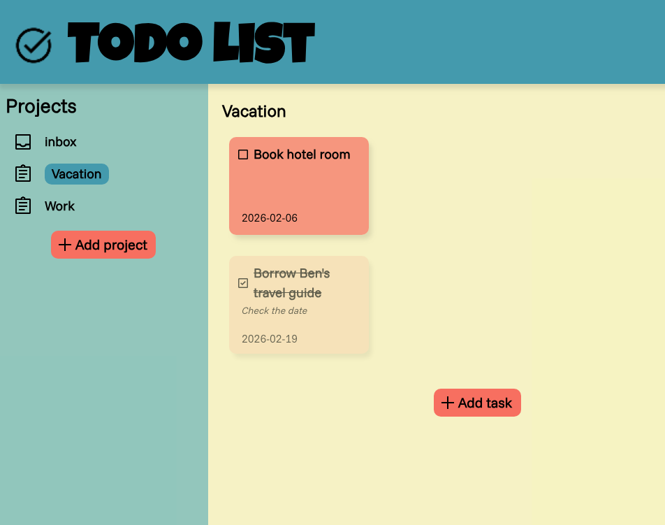

# odin-todo-list

The Todo List project from **The Odin Project** (JavaScript path). 
The objective was to build a dynamic and persistant task management application. This project focuses on modularity and local storage management.

[live demo](https://evicno.github.io/odin-todo-list/)

## Features

- **Todo list**: create/delete projects, add tasks with title, description, due date and priority level.
- **Data persistence**: use `localStorage` to save data even after closing the browser.
- **Dynamic status**: mark tasks as completed with instant status update.

## Technologies and concepts used

- **JavaScipt modules (ES6)**: Separation of responsibilities (DOM, logic, storage).
- **Factory Functions**: Creation of `task` and `project` objects with internal state (closures).
- **Storage**: Synchronization between objetcs in memory and JSON storage.
- **Single Responsibility Principle**: Each module has its own specific function.

## Challenges

- **localStorage Synchronization**: The biggest challenge was to maintain a "single source of truth". I had to restructure my code to avoid version conflicts.
- **JSON format**: When retrieving JSON data, the objects lose their methods. I had to pass them through the Factory Functions so that they become "alive" and functional again.
- **Single Responsibility Principle**: I had to fix bugs where the DOM manager was handling too much logic, which prevented automatic saving. I learned to centralize the logic in one module.